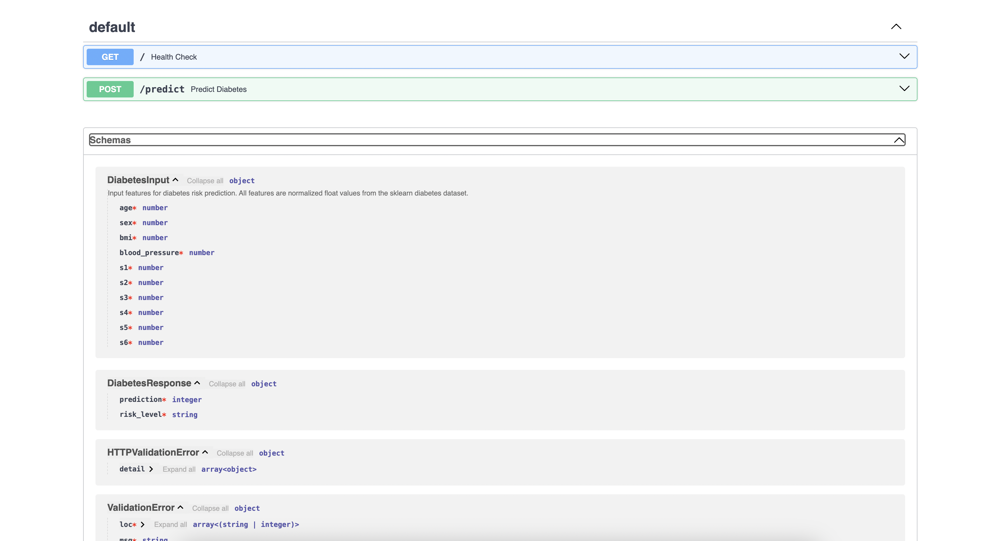
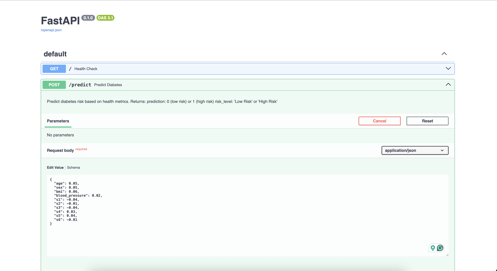
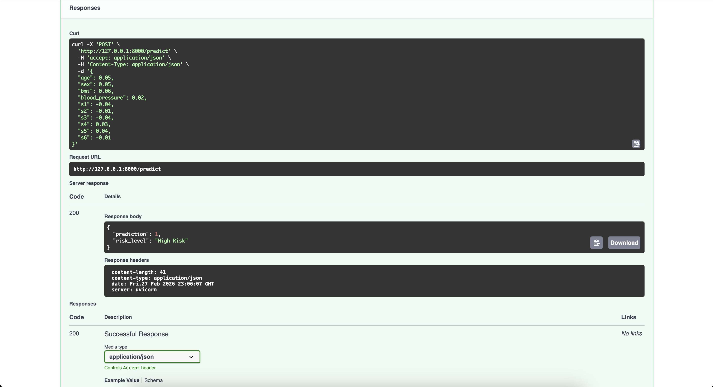
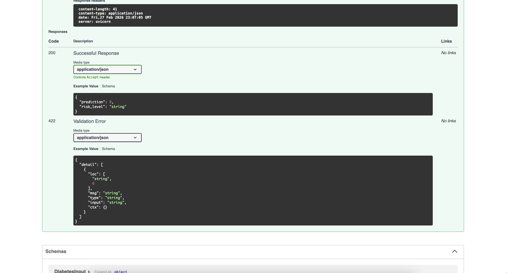

# Diabetes Risk Prediction API using FastAPI

## Overview

This lab demonstrates how to serve a Machine Learning model as a REST API using **FastAPI** and **uvicorn**. The project trains a **Random Forest Classifier** on the sklearn Diabetes dataset to predict whether a patient is at **high risk** or **low risk** for diabetes progression.

## LAB DETAILS

- **Dataset**: Used sklearn's Diabetes dataset
- **Model**: Used Random Forest Classifier
- **Task**: Converted regression target to binary classification (high risk vs low risk based on median threshold)
- **Response**: API returns both a numeric prediction and a human-readable risk level string
- **Features**: 10 input health metrics (age, sex, bmi, blood pressure, and 6 blood serum measurements)

## Project Structure

```
lab3/
├── assets/
│   ├── doc.png
│   ├── ApplicationResponse1.png
│   ├── ApplicationResponse2.png
│   └── ApplicationResponse3.png
├── diabetes_env/
├── model/
│   └── diabetes_model.pkl
├── src/
│   ├── __init__.py
│   ├── data.py
│   ├── main.py
│   ├── predict.py
│   └── train.py
├── README.md
└── requirements.txt
```

## File Descriptions

- **data.py** — Loads the diabetes dataset from sklearn and converts the target to binary classification. Splits data into training and testing sets.
- **train.py** — Trains a Random Forest Classifier with 100 estimators and max depth of 5. Saves the trained model as a `.pkl` file and prints accuracy.
- **predict.py** — Loads the saved model and runs predictions on new input data.
- **main.py** — Defines the FastAPI application with two endpoints: a health check (`GET /`) and a prediction endpoint (`POST /predict`).

## Setup and Installation

### 1. Clone the repository

```bash
git clone https://github.com/Nandana-125/MLOps-Labs-
cd MLOps-Labs-/lab3
```

### 2. Create and activate a virtual environment

```bash
python3 -m venv diabetes_env
source diabetes_env/bin/activate
```

### 3. Install dependencies

```bash
pip install -r requirements.txt
```

## Running the Lab

### Step 1: Train the model

```bash
cd src
python train.py
```

Expected output:

```
Model saved to ../model/diabetes_model.pkl
Model Accuracy: 0.7416
```

### Step 2: Start the API server

```bash
uvicorn main:app --reload
```

### Step 3: Test the API

Open your browser and go to `http://127.0.0.1:8000/docs` to access the Swagger UI.

#### API Endpoints

| Method | Endpoint   | Description                        |
| ------ | ---------- | ---------------------------------- |
| GET    | `/`        | Health check — returns API status  |
| POST   | `/predict` | Predicts diabetes risk from inputs |

#### Sample Request Body (POST /predict)

```json
{
  "age": 0.05,
  "sex": 0.05,
  "bmi": 0.06,
  "blood_pressure": 0.02,
  "s1": -0.04,
  "s2": -0.01,
  "s3": -0.04,
  "s4": 0.03,
  "s5": 0.04,
  "s6": -0.01
}
```

#### Sample Response

```json
{
  "prediction": 1,
  "risk_level": "High Risk"
}
```

## Screenshots

### API Documentation Page



### API Prediction Response





## Technologies Used

- Python 3.13
- FastAPI
- Uvicorn
- Scikit-learn (Random Forest Classifier)
- Pydantic
- Joblib
